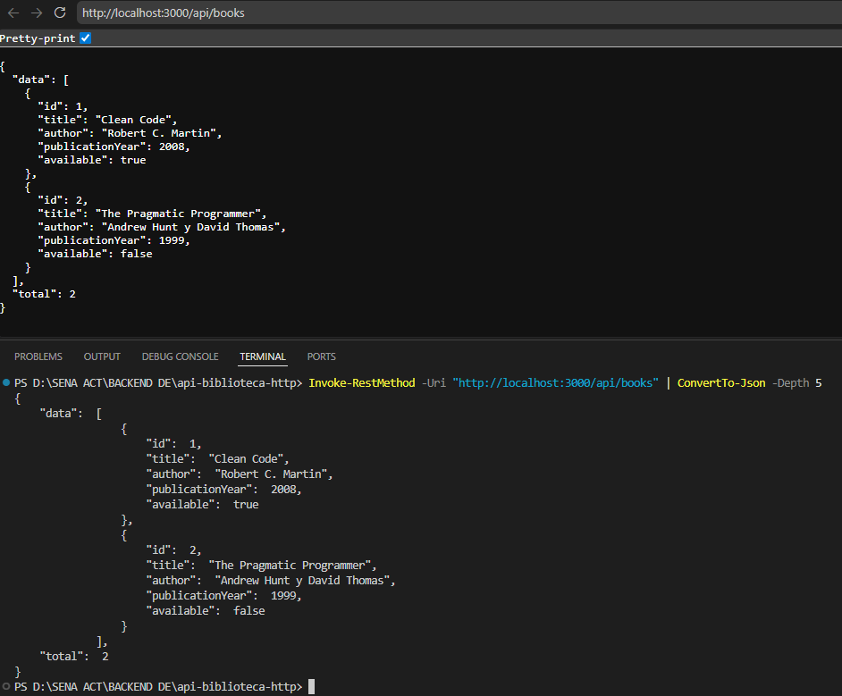
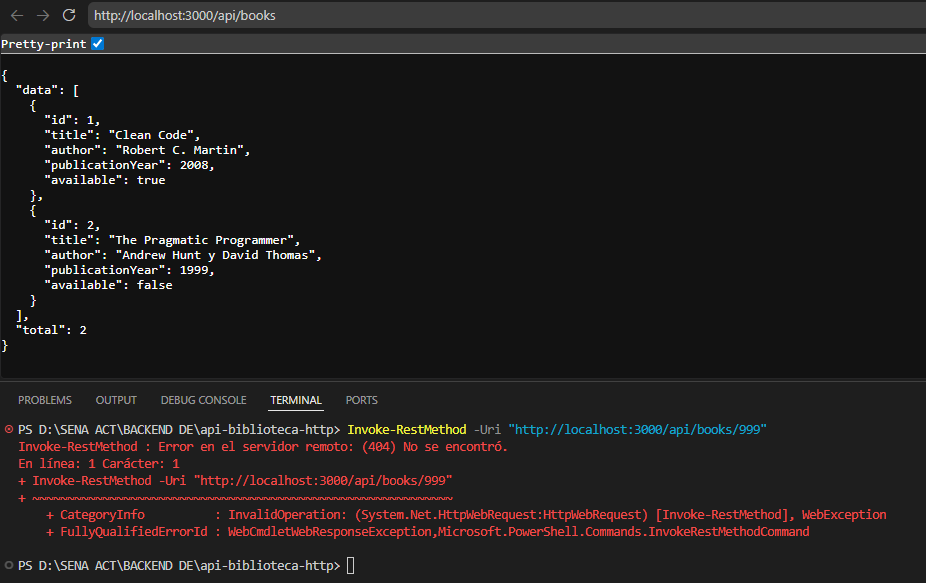
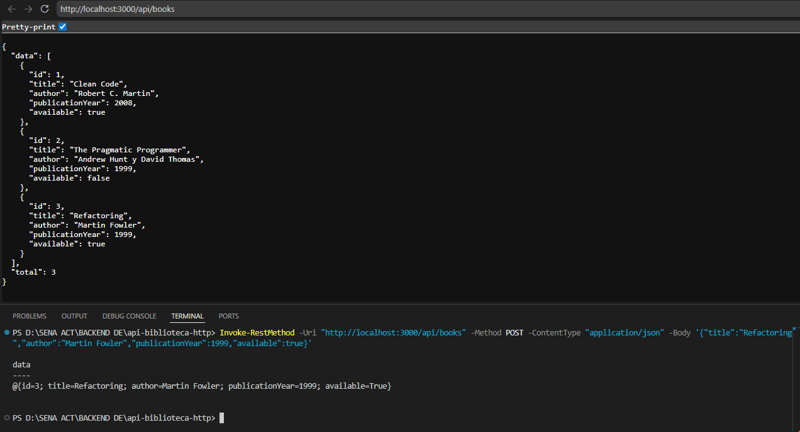
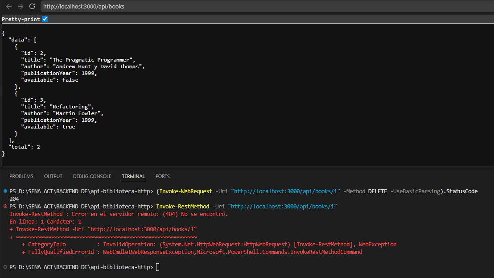

<div align="center">

# API REST — Sistema de Gestión de Biblioteca HTTP


API construida con Node.js y TypeScript para gestionar un catálogo de libros en memoria, implementando validaciones en runtime, códigos de estado HTTP adecuados y documentación técnica detallada.

</div>

---

## Tabla de Contenidos

1. [Descripción del Proyecto](#descripción-del-proyecto)
2. [Estructura del Proyecto](#estructura-del-proyecto)
3. [Requisitos Previos e Instalación](#requisitos-previos-e-instalación)
4. [Ejecución del Servidor](#ejecución-del-servidor)
5. [Verificación, Compilación y Producción](#verificación-compilación-y-producción)
6. [Endpoints de la API](#endpoints-de-la-api)
7. [Ejemplos de Uso](#ejemplos-de-uso)
8. [Pruebas y Evidencias](#pruebas-y-evidencias)
9. [Limitaciones](#limitaciones)
10. [Tecnologías Utilizadas](#tecnologías-utilizadas)
11. [Autor](#autor)

---

## Descripción del Proyecto

Esta API permite realizar operaciones **CRUD** (Crear, Leer, Actualizar, Eliminar) sobre una colección de libros almacenada en memoria. Cumple con las buenas prácticas de arquitectura HTTP/REST:

- **Contratos claros:** Entradas y salidas estructuradas en formato JSON.
- **Validación de datos en runtime:** Verificación estricta de tipos de datos, campos requeridos y rangos válidos.
- **Manejo de estados HTTP:** Respuestas normadas según la especificación (`200 OK`, `201 Created`, `204 No Content`, `400 Bad Request`, `404 Not Found`, `500 Internal Error`).

---

## Estructura del Proyecto

```text
api-biblioteca-http/
├── docs/
│   └── endpoints.md                 # Especificación técnica detallada de cada endpoint
├── evidencias/
│   ├── 01-get-books.png             # Captura de consulta del catálogo
│   ├── 02-get-book-not-found.png    # Captura de manejo de error 404
│   ├── 03-post-book.png             # Captura de creación exitosa (201)
│   └── 04-delete-book.png           # Captura de eliminación (204) y verificación (404)
├── src/                             # Código fuente de la aplicación
├── .gitignore
├── package.json
├── tsconfig.json                    # Configuración de TypeScript
└── README.md                        # Documentación principal
```

---

## Requisitos Previos e Instalación

### Requisitos

| Herramienta | Versión |
|-------------|---------|
| Node.js | 18 LTS o superior |
| npm | Incluido con Node.js |

### Pasos de Instalación

**1. Clonar el repositorio**

```bash
git clone <https://github.com/Jonathan20061613/Actividad_1_Api_Biblioteca_HTTP.git>
cd api-biblioteca-http
```

**2. Instalar dependencias**

```bash
npm install
```

---

## Ejecución del Servidor

Para iniciar el servidor en modo desarrollo con recarga automática:

```bash
npm run dev
```

> El servidor estará escuchando en **`http://localhost:3000`**

---

## Verificación, Compilación y Producción

**Verificación y comprobación de tipos**

Para validar que no existan errores de sintaxis o de TypeScript en el proyecto:

```bash
npm run check
```

**Producción local**

Para compilar el proyecto TypeScript a JavaScript ejecutable y desplegarlo en modo producción:

```bash
# Compilar el proyecto a la carpeta dist/
npm run build

# Iniciar el servidor compilado
npm start
```

---

## Endpoints de la API

A continuación se resume la tabla de endpoints expuestos por el servidor. Para revisar los payloads de petición/respuesta y las reglas detalladas de validación, consulta la **[Documentación Técnica de Endpoints](./docs/endpoints.md)**.

| Método | Endpoint | Descripción | Éxito | Errores |
|:------:|----------|-------------|:-----:|---------|
| `GET` | `/api/health` | Estado del servidor y conteo de libros | `200` | `500` |
| `GET` | `/api/books` | Consultar catálogo (filtros `author`, `available`) | `200` | `400` `500` |
| `GET` | `/api/books/:id` | Consultar un libro por su ID | `200` | `400` `404` `500` |
| `POST` | `/api/books` | Registrar un nuevo libro | `201` | `400` `500` |
| `PATCH` | `/api/books/:id` | Actualización parcial del libro | `200` | `400` `404` `500` |
| `DELETE` | `/api/books/:id` | Eliminar un libro del catálogo | `204` | `400` `404` `500` |

---

## Ejemplos de Uso

**GET** — Consultar catálogo completo

```bash
curl -X GET http://localhost:3000/api/books
```

**POST** — Registrar un nuevo libro

```bash
curl -X POST http://localhost:3000/api/books \
  -H "Content-Type: application/json" \
  -d '{
    "title": "Refactoring",
    "author": "Martin Fowler",
    "publicationYear": 1999,
    "available": true
  }'
```

**PATCH** — Actualizar disponibilidad de un libro

```bash
curl -X PATCH http://localhost:3000/api/books/1 \
  -H "Content-Type: application/json" \
  -d '{ "available": false }'
```

**DELETE** — Eliminar un libro

```bash
curl -X DELETE http://localhost:3000/api/books/1
```

---

## Pruebas y Evidencias

Comandos ejecutados en PowerShell y sus respectivas capturas de la respuesta del servidor:

**1. Consultar Catálogo de Libros** — `GET /api/books`

```powershell
Invoke-RestMethod -Uri "http://localhost:3000/api/books" | ConvertTo-Json -Depth 5
```



**2. Manejo de Recurso No Encontrado** — `GET /api/books/999`

```powershell
Invoke-RestMethod -Uri "http://localhost:3000/api/books/999"
```



**3. Registro de Nuevo Libro** — `POST /api/books`

```powershell
Invoke-RestMethod -Uri "http://localhost:3000/api/books" -Method POST -ContentType "application/json" -Body '{"title":"Refactoring","author":"Martin Fowler","publicationYear":1999,"available":true}'
```



**4. Eliminación de Libro y Verificación** — `DELETE /api/books/1`

```powershell
# 1. Eliminar libro
(Invoke-WebRequest -Uri "http://localhost:3000/api/books/1" -Method DELETE -UseBasicParsing).StatusCode

# 2. Confirmar eliminación (retorna 404)
Invoke-RestMethod -Uri "http://localhost:3000/api/books/1"
```



---

## Limitaciones

- **Almacenamiento volátil en memoria:** los datos se persisten únicamente en la memoria RAM del proceso Node.js. Al reiniciar o apagar el servidor, las modificaciones (creaciones, actualizaciones o eliminaciones) vuelven a su estado inicial programado.
- No cuenta con autenticación ni autorización de usuarios.
- No incluye persistencia en base de datos (no hay conexión a un motor externo).

---

## Tecnologías Utilizadas

| Categoría | Tecnología |
|-----------|------------|
| Lenguaje | TypeScript / JavaScript (Node.js) |
| Framework | Express.js |
| Pruebas de cliente | PowerShell (`Invoke-RestMethod` / `Invoke-WebRequest`) |
| Control de versiones | Git & GitHub |

---

## Autor

**Jonathan Andrés Jiménez Aguilera - 3311976**
Análisis y Desarrollo de Software (ADSO) — SENA

---

<div align="center">

**Fin de la Documentación**

</div>